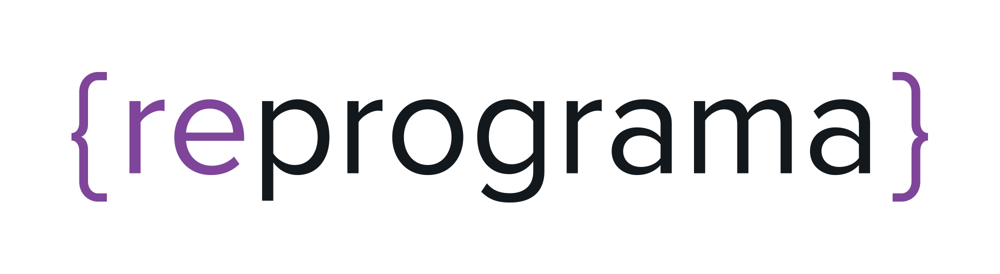

# Projeto Final - Reprograma

        Análise Socioeconômica da População em Situação de Rua - RJ

## Descrição

Projeto final do Curso de Python para Análise de Dados da Reprograma, que analisa dados socioeconômicos da população em situação de rua no estado do Rio de Janeiro, com base em pesquisas de 2020 e 2022.

## Objetivo

Este estudo se propõe a analisar os dados coletados no censo realizado pela Prefeitura do Rio de Janeiro, com o objetivo de compreender melhor o perfil e as necessidades dessa população vulnerável.

## Bancos de Dados

Os dados foram coletados no site da Datario, da Prefeitura do Rio de Janeiro, tangíveis nos links a seguir:

[Base 2020](https://censorua-pcrj.hub.arcgis.com/documents/64fc9f1756b64f05827a54de8c89a5ed)
[Base 2022](https://censorua-pcrj.hub.arcgis.com/documents/64fc9f1756b64f05827a54de8c89a5ed)

## Ferramentas utilizadas

As ferramentas a seguir foram utilizadas para o processo de extração, tratamendo, carregamento, análise e visualização de dados.

Python
Pandas
NumPy
Matplotlib
Seaborn
Vscode
Google colaboratoury
Tableau

O processo de extração e análises iniciais podem ser averigueadas através do arquivo 'ipynb' do [Collab]
(https://colab.research.google.com/drive/1l_B4JBsSa8F0en_IZLSqp5kuT0EHumkr?usp=sharing)

## Análises e visualização

A Análise completa poderá ser observada no [Tabeau Public](https://public.tableau.com/app/profile/maria.betania.paiva.nunes4824/viz/ProjetoFinal-Reprograma_17226451950550/Sade)